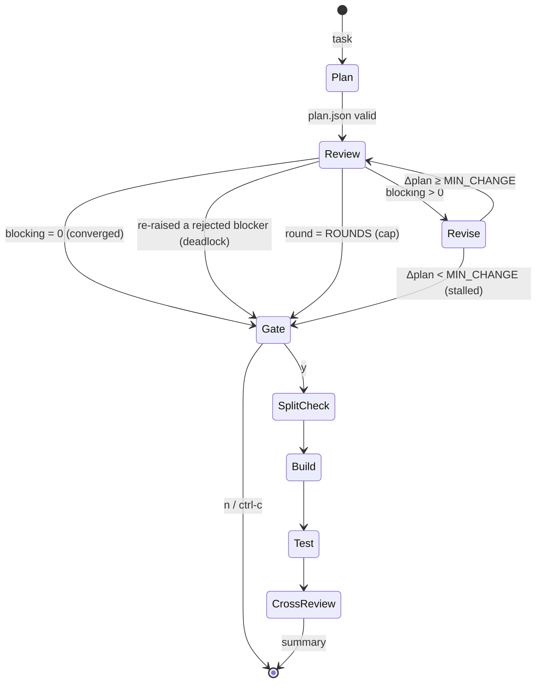

<div align="center">

```
┌┬┐┬ ┬┌─┐
 │││ ││ │
─┴┘└─┘└─┘
```

**Two models. One plan. Zero merge conflicts.**

Codex plans · Claude reviews · git worktrees build · the other model reviews the diff

[](https://www.npmjs.com/package/@electricmonkey/duo)


</div>

---

## TL;DR

```bash
npm install -g @electricmonkey/duo
duo doctor
cd your-repo && duo
```

```
duo › add e2e smoke tests for login, dashboard and capture

  ✓ plan          codex     1m52s  3 task(s) · wants parallel
  ● review r1     claude    2m40s  1 blocking · 2 should · 1 nit
  ✓ revise r1     codex     0m58s  14 lines changed · 3 accepted · 0 rejected
  ✓ review r2     claude    1m31s  0 blocking · 0 should · 2 nit

  ┌────────────────────────┬────────────┬─────────┬──────────────────────┐
  │ task                   │ state      │    time │ timeline             │
  ├────────────────────────┼────────────┼─────────┼──────────────────────┤
  │ ✓ login-smoke          │ done       │   7m12s │ ░░░█████████████████ │
  │ ✓ dashboard-smoke      │ done       │   5m03s │ ░░░███████████······ │
  │ ✓ capture-smoke        │ done       │   6m20s │ ░░░████████████████· │
  └────────────────────────┴────────────┴─────────┴──────────────────────┘
  ⇉ 3 tasks · wall 7m12s · serial est. 16m55s · saved ~9m43s (2.3× faster)
```

> [!WARNING]
> Early software. duo drives two agents that have write access to files. It never touches your checkout while building and never merges without asking, but read the [threat model](#threat-model) before pointing it at anything you care about.

---

## Table of contents

- [Why](#why)
- [Theory of operation](#theory-of-operation)
- [The convergence loop, formally](#the-convergence-loop-formally)
- [Parallelism, or: when is a task embarrassingly parallel?](#parallelism-or-when-is-a-task-embarrassingly-parallel)
- [Time accounting](#time-accounting)
- [Install](#install)
- [Usage](#usage)
- [Configuration](#configuration)
- [On-disk layout](#on-disk-layout)
- [Wire formats](#wire-formats)
- [Threat model](#threat-model)
- [Signals](#signals)
- [Known limitations](#known-limitations)
- [Hacking on duo](#hacking-on-duo)
- [FAQ](#faq)

---

## Why

A model reviewing its own plan tends to agree with itself. A model from a different lab, with different training data and different blind spots, disagrees in more useful ways. The obvious workflow is to paste plans between two terminals. The obvious problem is that you become a very slow, very expensive message bus.

duo removes you from the loop until the loop has something worth your attention.

It also fixes the three ways naive plan/review ping-pong goes wrong:

| failure mode | symptom | duo's countermeasure |
|---|---|---|
| reviewers always find *something* | round 5 is arguing about variable names | severity classes; only `blocking` keeps the loop alive |
| amnesia | settled points get re-raised every round | a decision **ledger** the reviewer must read |
| oscillation | A adds X, B removes X, A adds X | **deadlock** detection hands the decision to you |

---

## Theory of operation



The roles are fixed during planning and swappable during building:

| phase | agent | may write to | runs in |
|---|---|---|---|
| plan | codex | `.duo/<run>/` only | your checkout |
| review | claude | `.duo/<run>/` only | your checkout |
| revise | codex | `.duo/<run>/` only | your checkout |
| build | `IMPL` (default claude) | source files | `../<repo>-wt-<run>-<task>` |
| test | duo itself (plain `bash -c`) | whatever your tests write | the worktree |
| code review | the *other* agent | `.duo-review.json` only | the worktree |

Agents never commit. duo stages, commits, diffs and merges; the agents only ever produce files.

---

## The convergence loop, formally

Let round *i* produce a review $R_i$, a set of issues $r = (\text{id}, \text{sev}, \text{claim}, \text{evidence}, \text{reraised})$ with $\text{sev} \in \{\text{blocking}, \text{should}, \text{nit}\}$.

Let $L$ be the ledger: an append-only list of decisions $(\text{id}, d, \text{reason}, \text{round})$ with $d \in \{\text{accepted}, \text{rejected}, \text{deferred}\}$.

Define

$$B_i = \lbrace r \in R_i : r.\text{sev} = \text{blocking} \rbrace$$

$$D_i = \lbrace r \in B_i : r.\text{reraised} \land \exists\, \ell \in L : \ell.\text{id} = r.\text{id} \land \ell.d = \text{rejected} \rbrace$$

$$\Delta_i = \lvert \text{diff}(\text{PLAN}_{i-1}, \text{PLAN}_i) \rvert + \text{MIN\_CHANGE} \cdot [\text{plan.json changed}]$$

The loop terminates at the first rule that fires:

| rule | condition | meaning |
|---|---|---|
| ✅ converged | $\lvert B_i \rvert = 0$ | nothing blocks; `should` and `nit` are advisory |
| ⚠️ deadlock | $D_i \neq \emptyset$ | the planner said no with a reason, the reviewer insists without new evidence. A human breaks the tie. |
| ❌ cap | $i = \text{ROUNDS} \land \lvert B_i \rvert > 0$ | no revise after the last review, because an unreviewed revision is worse than a known blocker |
| ⚠️ stalled | $\Delta_i < \text{MIN\_CHANGE}$ | the revision was cosmetic, so another review would just re-read the same plan |

Termination is guaranteed in at most `ROUNDS` reviews and `ROUNDS − 1` revisions. A structural change to `plan.json` always counts as at least `MIN_CHANGE` lines, so re-scoping a task can never be mistaken for a stall.

Issue ids are `R<round>-<n>`. A reviewer that re-raises a settled issue must reuse its id and set `reraised: true`. That is what makes deadlock detectable with a single `jq` expression instead of fuzzy matching on prose.

---

## Parallelism, or: when is a task embarrassingly parallel?

Almost never, it turns out. duo is deliberately pessimistic.

A plan is built in parallel only if **all** of these hold:

1. the planner set `parallel: true`,
2. the plan has at least 2 tasks,
3. `SPLIT` is not `off`,
4. no file appears in more than one task's `files` array (checked mechanically: `jq … | sort | uniq -d`),
5. the reviewer didn't flag the split as blocking.

Rule 4 is duo's own check and overrides the planner. Rule 5 is where hidden coupling gets caught: shared types, config, migrations, lockfiles, translation files and test fixtures all count as coupling, and the reviewer is told so explicitly.

Practical corollary: one shared `i18n/da.json` serialises your whole plan. Tasks that each create their own new file (tests, isolated components) split well.

Each task gets its own worktree and branch:

```
~/src/
├── parity/                               ← your checkout, untouched
├── parity-wt-20260916-101500-login-smoke/      branch duo/20260916-101500/login-smoke
├── parity-wt-20260916-101500-dashboard-smoke/  branch duo/20260916-101500/dashboard-smoke
└── parity-wt-20260916-101500-capture-smoke/    branch duo/20260916-101500/capture-smoke
```

Worktrees are created **serially** (git's lock files do not enjoy concurrency), then up to `PARALLEL` workers run concurrently. The scheduler is a polling loop over `jobs -rp`, because `wait -n` doesn't exist in the bash that ships with macOS.

---

## Time accounting

Every worker appends `phase epoch` lines to `times-<task>`:

```
setup  1789545300
build  1789545341
test   1789545702
review 1789545730
end    1789545732
```

For $n$ built tasks with start $a_k$, end $e_k$ and mean setup time $\bar{s}$:

$$T_{\text{wall}} = \max_k e_k - \min_k a_k$$

$$T_{\text{serial}} \approx \sum_k (e_k - a_k) - (n - 1)\,\bar{s}$$

The $(n-1)\,\bar{s}$ term exists because a serial run installs dependencies once, not once per task. Leaving it in would flatter the speedup, and nobody likes a benchmark that lies.

$$\text{saved} = T_{\text{serial}} - T_{\text{wall}}, \qquad \text{speedup} = T_{\text{serial}} / T_{\text{wall}}$$

**Before** building, the gate predicts the same numbers from history. With $\bar{t}$ the mean task duration over all previous runs in the repo and $P' = \min(P, n)$ slots:

$$\hat{T}_{\text{serial}} = n\,\bar{t}, \qquad \hat{T}_{\text{parallel}} = \left\lceil n / P' \right\rceil \bar{t}$$

With no history, it prints the theoretical ceiling $n / \lceil n / P' \rceil$ and says so. Amdahl sends his regards.

The timeline column maps wall time onto 20 cells. Cell $k$ samples the phase active at $t_0 + \frac{(2k+1)\,\text{span}}{40}$:

```
░ setup   █ build   █ test   █ review   · idle
```

---

## Install

```bash
npm install -g @electricmonkey/duo     # or: bun add -g @electricmonkey/duo
duo doctor
```

Requirements:

| | minimum | why |
|---|---|---|
| OS | macOS or Linux | POSIX process groups, `pgrep`, worktrees next to the repo |
| bash | 3.2 | yes, the 2007 one Apple still ships |
| git | 2.5+ | `git worktree` |
| jq | 1.6+ | `IN()` in the deadlock query |
| `claude` | a version with `--permission-mode` | Claude Code, logged in |
| `codex` | a version with `exec --sandbox` | Codex CLI, logged in |

duo has no API keys of its own. It shells out to the two CLIs and uses whatever subscription or key they're logged in with.

`duo doctor` checks all of the above the way duo sees it: from a non-interactive bash, where your zsh aliases don't exist. If `claude` only works because of an alias, doctor tells you how to symlink it.

Update with `duo update`. It detects whether it was installed via npm, bun or a git checkout and does the right thing.

---

## Usage

```bash
duo                          # interactive session
duo "add refund webhooks"    # one-shot
duo /config                  # run a single slash command and exit
duo doctor                   # dependency check
duo update                   # latest version
duo --version
```

At the gate:

| key | action |
|---|---|
| `y` | build |
| `p` | read `PLAN.md` in `$PAGER` |
| `e` | edit `PLAN.md` and `plan.json` in `$EDITOR`; the split is re-checked afterwards |
| `n` / `enter` / `ctrl-c` | stop, keep the plan |

Slash commands:

| command | effect |
|---|---|
| `/config` | show effective settings and where they came from |
| `/impl claude\|codex` | who builds; the other reviews the code |
| `/rounds N` | max plan/review rounds (1–10) |
| `/minchange N` | stall threshold in changed lines (0–500) |
| `/split auto\|prefer\|off` | planner's appetite for parallelism |
| `/parallel N` | max concurrent worktrees (1–8) |
| `/setup auto\|none\|<cmd>` | per-worktree install step |
| `/test auto\|none\|<cmd>` | test step before code review |
| `/env on\|off` | copy `.env*` into worktrees |
| `/planonly on\|off` | stop after the plan loop |
| `/save` · `/save global` | persist for this repo · for all repos |
| `/reset` | built-in defaults (not persisted) |
| `/runs` | recent runs |
| `/show [run]` | plan card and results of a run |
| `/merge [run]` | `--no-ff` merge a run's branches, stop on conflict, run tests |
| `/trees` | list duo worktrees |
| `/clean [all]` | remove duo worktrees and branches (`all`: also run logs) |
| `/doctor` · `/update` · `/clear` · `/quit` | what they say |

The prompt has readline editing and persistent history in `~/.config/duo/history`.

---

## Configuration

Settings resolve in this order, later wins:

```
built-in defaults
  → ~/.config/duo/config        (/save global)
    → <repo>/.duo/config        (/save)
      → environment             (DUO_<KEY>)
        → slash commands        (this session only)
```

| key | default | env |
|---|---|---|
| `IMPL` | `claude` | `DUO_IMPL` |
| `ROUNDS` | `3` | `DUO_ROUNDS` |
| `MIN_CHANGE` | `5` | `DUO_MIN_CHANGE` |
| `PARALLEL` | `3` | `DUO_PARALLEL` |
| `SPLIT` | `auto` | `DUO_SPLIT` |
| `SETUP` | `auto` | `DUO_SETUP` |
| `TEST` | `auto` | `DUO_TEST` |
| `ENV_COPY` | `on` | `DUO_ENV_COPY` |
| `PLAN_ONLY` | `off` | `DUO_PLAN_ONLY` |

Config files are parsed as `KEY=value` lines against an allowlist. They are never `source`d, so a config file can't execute code.

`SETUP=auto` resolves by lockfile:

| lockfile | command |
|---|---|
| `bun.lock` / `bun.lockb` | `bun install --frozen-lockfile` |
| `pnpm-lock.yaml` | `pnpm install --frozen-lockfile` |
| `yarn.lock` | `yarn install --frozen-lockfile` |
| `package-lock.json` | `npm ci` |
| `pubspec.yaml` | `flutter pub get` |

`TEST=auto` resolves to `<pm> run test` if `package.json` has a `test` script, otherwise nothing.

Other environment variables honoured: `EDITOR`, `PAGER`, `NO_COLOR`.

---

## On-disk layout

Everything lives under `.duo/`, which duo adds to `.git/info/exclude` (local, never committed, shared by all worktrees). Your `.gitignore` stays untouched.

```
.duo/
├── config                        per-repo settings (/save)
└── 20260916-101500/              one run
    ├── task.txt                  the prompt, verbatim
    ├── status                    planning · converged · stalled · deadlock · cap
    │                             · failed · cancelled · building · built
    ├── PLAN.md                   human-readable plan
    ├── plan.json                 machine-readable plan
    ├── PLAN.prev.md              previous revision (stall detection)
    ├── plan.prev.json
    ├── ledger.json               decision log
    ├── review-<i>.json           review of round i
    ├── loop                      <status>:<rounds>
    ├── last_review · dead        pointers for the gate
    ├── split · dupes             final split decision and overlapping files
    ├── ids · task-<id>.md        the task list handed to workers
    ├── state-<id>                queued → setup → building → testing → reviewing → done
    ├── times-<id>                phase timestamps
    ├── tests-<id>                pass | fail
    ├── codereview-<id>.json      cross-review of the diff
    ├── merged-test.log           tests after /merge
    └── *.log                     raw agent output (plan, review-i, revise-i,
                                  setup-, impl-, test-, codereview-, worktree-)
```

Inside each worktree, duo drops `.duo-plan.md`, `.duo-task.md`, `.duo-diff.patch`, `.duo-test.log` and `.duo-review.json`. They match the `.duo*` exclude pattern, so they never end up in a commit.

---

## Wire formats

`plan.json`:

```json
{
  "summary": "string",
  "parallel": true,
  "reason": "why this is or isn't parallel",
  "tasks": [
    {
      "id": "kebab-case",
      "title": "string",
      "instructions": "string",
      "files": ["path/relative/to/repo"]
    }
  ]
}
```

`review-<i>.json` and `codereview-<id>.json`:

```json
{
  "issues": [
    {
      "id": "R2-1",
      "severity": "blocking | should | nit",
      "claim": "what is wrong",
      "evidence": "file:line or a concrete reason",
      "reraised": false
    }
  ]
}
```

`ledger.json`:

```json
[
  { "id": "R1-1", "decision": "rejected", "reason": "handled in middleware, see src/auth.ts:40", "round": 1 }
]
```

Every file an agent writes is validated with `jq` before duo acts on it. Invalid JSON fails the run loudly instead of being interpreted optimistically.

---

## Threat model

What duo guarantees:

- It refuses to start with uncommitted changes to tracked files.
- Planning and review prompts forbid source changes, and those phases only need to write inside `.duo/`.
- Building happens exclusively in fresh worktrees. Your checkout is only written to by `/merge`, which asks first.
- `.env*` files are copied into worktrees for tests and explicitly unstaged before every commit.
- `/merge` uses `--no-ff`, aborts on the first conflict, and runs your tests on the result.

What duo does **not** guarantee:

- Prompts are not a sandbox. The real boundaries are the agents' own: Claude runs with `--permission-mode acceptEdits` (file edits allowed, arbitrary shell commands not auto-approved), Codex runs with `--sandbox workspace-write` (writes limited to its working directory and temp dirs). Read their docs for the precise semantics of the versions you have installed.
- Your `SETUP` and `TEST` commands run with your full user privileges. So do your tests.
- A repository you don't trust can contain instructions aimed at agents (in READMEs, comments, fixtures). Don't run duo on code you wouldn't run yourself.

---

## Signals

| where | `ctrl-c` does |
|---|---|
| prompt | quit |
| running step | kill the whole agent process tree (`pgrep -P`, recursively), return to the prompt |
| gate | stop the run, keep the plan |

Why the manual tree-walk: in a non-interactive bash, background jobs ignore `SIGINT`, and the agents spawn their own children. A plain `kill $!` would orphan them.

---

## Known limitations

- `claude -p` only prints when it finishes. Live activity comes from `--output-format stream-json`, so the spinner shows tool calls, not prose.
- The live board needs a terminal at least 76 columns wide.
- Agent CLIs change their flags often. If a run fails instantly, run `duo doctor` and check the step's log.
- The "serial estimate" assumes task durations are independent of concurrency. On a laptop with three agents and three `bun install`s running, they aren't entirely.
- Semantic conflicts survive textual merges. Always run the full test suite after `/merge`, which duo does if `TEST` resolves to something.
- Windows is unsupported. WSL may work; nobody has tried.

---

## Hacking on duo

duo is one bash file, `bin/duo`, on purpose. Ground rules:

1. **bash 3.2 compatible.** No associative arrays, no `mapfile`, no `wait -n`, no `${var,,}`, no empty arrays under `set -u`.
2. **No runtime dependencies beyond git and jq.** If you want Python, you want a different project.
3. **Agents produce files, duo produces commits.** Keep it that way.
4. **Every agent output is validated before use.**

Local development:

```bash
git clone https://github.com/electric-monkey/duo && cd duo
npm link              # global `duo` now points at your checkout
bash -n bin/duo       # syntax check
shellcheck bin/duo    # recommended
```

Don't `npm install -g @electricmonkey/duo` on your dev machine; it replaces the link with the published copy.

Releasing (the version lives in two places):

```bash
V=2.2.1
sed -i '' "s/^VERSION=.*/VERSION=\"$V\"/" bin/duo
npm version $V --no-git-tag-version
git commit -am "duo $V" && git tag v$V && git push --follow-tags
npm publish
```

For end-to-end tests without burning tokens, put stub `claude` and `codex` scripts first on your `PATH` that write the expected JSON files. duo only cares about what lands on disk.

---

## FAQ

**Why is Codex the planner and Claude the reviewer?**
Because a fixed assignment makes the ledger and the logs easier to reason about. The builder is configurable with `/impl`, and the code reviewer is always the other model.

**Why not just ask one model to review itself?**
Same-model review shares the same blind spots. Cross-model disagreement is the signal duo is built to surface.

**Why bash?**
Because every machine that runs `claude` and `codex` already has it, and the job is 90% orchestrating processes and files. The remaining 10% is `jq`.

**The review found zero issues in round 1. Should I trust it?**
Check `review-1.log`. A good review cites the files it read. If it doesn't, the plan wasn't really reviewed.

**Why does my task always end up serial?**
Probably a shared file: a translation catalogue, a barrel `index.ts`, a lockfile. Try `/split prefer`, and phrase tasks so each creates its own files.

**Is this affiliated with Anthropic or OpenAI?**
No. It's a shell script that calls their CLIs.

---

<div align="center">

MIT · made by [Electric Monkey](https://github.com/electric-monkey)

`while (( blocking > 0 && round < ROUNDS )); do argue; done`

</div>
